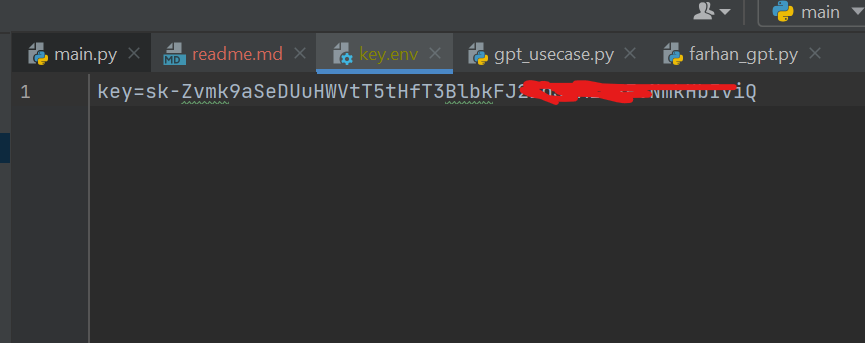

this project aims to wrap the use cases of chat-gpt
into one package in order to make our life easier.

this project uses Python 3.10.9, I guess it should be fine 
if you use 3.6 above.

## REQUIREMENTS
- First thing first you have to clone/download this repo. 
- After that install the requirements by hit the `pip install -r requirements.txt`. 
- create ``config`` directory
- create ``key.env`` file and put it in the `config` directory that you have been created
- put your ``OpenAPI token key`` in the `key.env` file, notice the picture bellow:


## HOW TO USE
Let's say you want to use the `code_explainer()` function. Please
read the sample bellow:

```doctest
# import the module/class
from gpt_usecase import UseCaseGPT

if __name__ == '__main__':

    # define the UseCaseGPT()
    usecase = UseCaseGPT()
    # pass your code path you want to be explained as the argument in the file_path parameter
    result = usecase.code_explainer(file_path="farhan_gpt.py")
    # the explanation will be returned as a string
    print(result)
```


